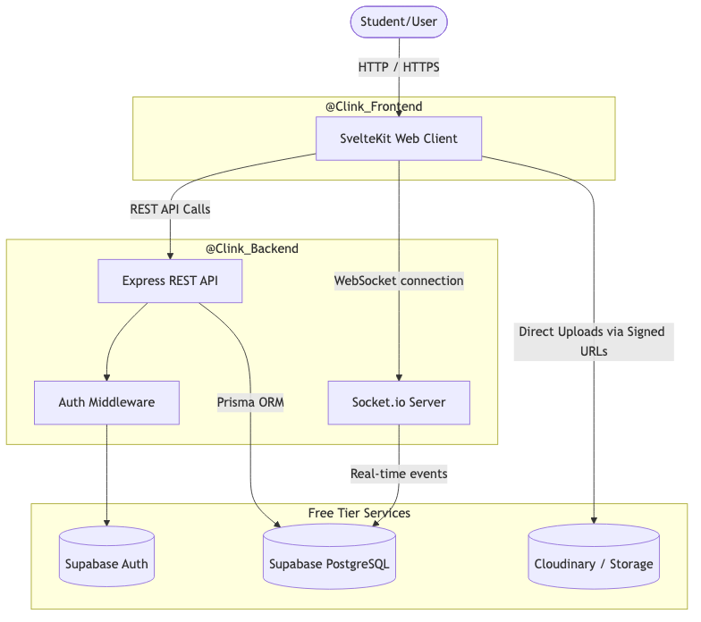
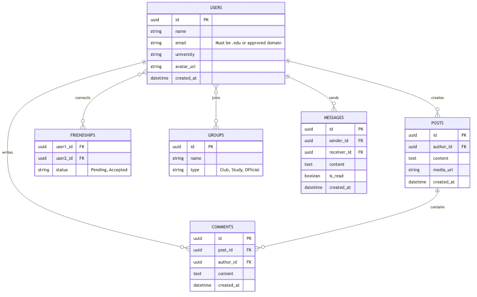
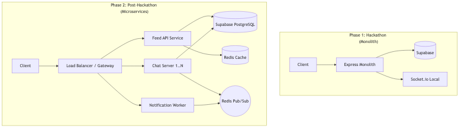
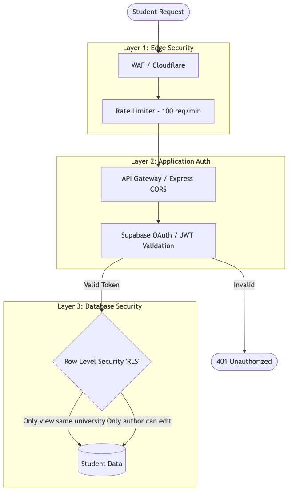
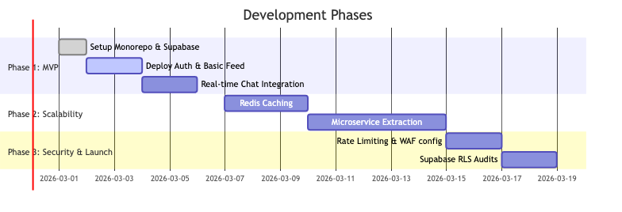

---
pdf_options:
  format: A4
  margin: 20mm
  printBackground: true
---

# Clink: Campus Social Network

System Architecture & Technical Whitepaper  Prepared for the Hackathon Evaluation Committee

## Executive Summary

**Clink** is an exclusive, student-focused social networking platform tailored specifically for university and college campuses. While functionally inspired by the core mechanics of traditional social media giants, Clink deliberately constrains its scope. By enforcing a hyper-localized digital ecosystem, it fosters secure, highly relevant communities where students can collaborate, trade, and communicate without the noise of the open internet.

This document outlines the technical foundation of Clink. It is designed to answer not just *what* technologies are being used, but *why* they were chosen. Our primary constraints—a hackathon-imposed zero-dollar budget and the need for rapid prototyping—have dictated a highly calculated approach. We have engineered a system that is fully functional and free at genesis, yet fundamentally structured to scale to millions of users without triggering a complete rewrite.

"Our architecture proves that financial constraints do not require technical compromises. By intelligently orchestrating modern open-source tools and serverless ecosystems, Clink achieves enterprise-grade scalability and security entirely on free-tier infrastructure."

## Chapter 1: The Technology Stack & Value Proposition

To achieve our goals, we adopted a **Monorepo Architecture**, strictly dividing our application into `@Clink_Frontend` and `@Clink_Backend` namespaces. This approach allows a single point of truth for our code while physically separating the execution layers—vital for future scaling.

### Frontend: The Reactive Edge (`@Clink_Frontend`)
The user interface is the only part of the system the student actually experiences. It must be blazing fast, intuitive, and accessible.

* **SvelteKit:** Unlike traditional frameworks that ship heavy virtual DOMs to the browser, Svelte compiles away, shipping pure, highly optimized vanilla JavaScript. **User Benefit:** Pages load instantly even on poor campus Wi-Fi networks, ensuring students never abandon the platform due to lag.
* **Tailwind CSS & shadcn-svelte:** We utilize mathematical design systems rather than writing custom CSS. **User Benefit:** The application feels premium and native from day one, establishing critical user trust without requiring weeks of design labor.
* **Vercel Edge Hosting:** Our frontend code is distributed globally. **User Benefit:** A student accessing Clink from a campus in Asia gets the exact same millisecond response time as a student in North America.

### Backend: The Data Engine (`@Clink_Backend`)
Our backend acts as the central brain—processing real-time campus feeds, handling instant messaging, and rigidly enforcing security boundaries.

* **Node.js (Express) & Socket.io:** We utilize a lightweight, event-driven JavaScript server paired with WebSockets. **User Benefit:** When a professor posts an urgent announcement, or a peer sends a direct message, it appears instantly on the recipient's screen without them needing to refresh the page.
* **Supabase (PostgreSQL Validated):** Instead of building a database from scratch, we leverage Supabase—an open-source Firebase alternative backed by robust PostgreSQL. **User Benefit:** It provides military-grade data integrity and built-in remote authentication (OAuth), ensuring student data is never compromised or lost.
* **Prisma ORM:** We interact with our database using strictly typed models. **User Benefit:** It mathematically eliminates entire categories of data-corruption bugs before the code even runs, ensuring a highly stable platform.

## Chapter 2: System Architecture & Data Flow

Understanding how data moves through Clink is essential. The architecture is designed to minimize the distance between the student and their data.

When a student opens Clink, the SvelteKit application loads immediately from the nearest edge node. Secure REST API calls are dispatched to the Express server to fetch the campus feed, while a persistent bidirectional WebSocket is opened simultaneously to listen for live events (like immediate chat messages or post likes).

### The Direct-to-Storage Strategy
Notice the bypass mechanism in our visual flow: when a student uploads a textbook photo to the Marketplace, the file does not bottleneck our API server. Instead, our Express server issues a temporary, cryptographic "Signed URL". The user's device uploads the heavy image directly to the Cloudinary/Supabase storage buckets. This architectural decision alone saves immense server costs and drastically reduces upload failure rates.

## Chapter 3: Data Integrity & Relationships

A social network is simply a complex web of relationships. Our PostgreSQL database is modeled to handle these associations rapidly and safely.

The schema revolves around the central `USERS` table. Everything a student does—writing a `POST`, leaving `COMMENTS`, establishing `FRIENDSHIPS`, or sending `MESSAGES`—is securely linked back to their core identity through cryptographic UUIDs (Universally Unique Identifiers).

By defining strict Foreign Keys (`FK`), the database itself refuses to accept orphaned data. For instance, if a user account is deleted, the database engine will automatically cascade and clean up all their associated posts and messages, preventing the application from breaking when trying to render non-existent content.

## Chapter 4: Progressive Scalability

The most critical mistake made during hackathons is building a fragile "Monolith" that must be completely destroyed and rebuilt when the platform gains real traction. Clink is designed with **Progressive Scalability**. 

### From MVP to Microservices

During Phase 1 (The Hackathon), our entire backend acts as a monolithic Express server. This is intentional: it allows rapid, friction-free iteration.

However, as we expand to hundreds of campuses, the system is designed to fracture seamlessly into dedicated Microservices.

**How this benefits the platform:**
Imagine it is mid-term season. Thousands of students are checking their feed simultaneously, placing immense load on the primary API. Because we decouple our services in Phase 2, this massive feed spike will not impact the Chat Server. Direct messages will continue to function perfectly with zero lag, because they are routed through independent servers synchronized by an ultra-fast Redis Cache layer.

## Chapter 5: Uncompromising Security

Clink operates exclusively for students. Consequently, protecting student identity, campus location data, and private academic correspondence is our highest priority. We do not rely on a single wall of defense; we employ a layered security matrix.

### The Three Layers of Defense

1. **Edge Protection (WAF):** Before a request even reaches our code, Cloudflare/Vercel analyzes it. If a malicious bot attempts to spam the campus forum, the Rate Limiter cuts them off at the network edge, preserving server resources for real students.
2. **Stateless Authentication:** We do not roll our own cryptographic hashing. All sign-ins are handled via Supabase Auth. The API server only accepts mathematically verified JWTs (JSON Web Tokens), instantly rejecting impersonators. Furthermore, registration requires a `.edu` email address verification to maintain the walled-garden campus integrity.
3. **Row Level Security (RLS):** This is our fail-safe. Even if a hypothetical vulnerability allowed someone to bypass the Express server and query the database directly, Supabase's RLS policies examine the identity of the requester. The database itself will physically refuse to return rows of data (posts, messages) that do not belong to the user's registered `university_id`. 

## Chapter 6: Strategic Delivery Roadmap

To bridge the gap between abstract design and tangible execution, we have structured our development into three aggressive, realistic phases.

**Phase 1: Minimum Viable Product (The Hackathon Focus)**
We prioritize the Core Loop. If the interface is not beautiful and the fundamental action of posting to a feed is broken, backend scalability does not matter. We dedicate our initial sprint entirely to UI perfection with Svelte and basic database hookups.

**Phase 2 & 3: Resilience and Reinforcement**
Only once the product is proven do we invest time into extracting microservices, implementing Redis caching for speed, and auditing our database Row Level Security. 

By heavily front-loading our architectural planning, Clink is positioned to be built at the speed required for a hackathon, with the structural integrity required for a funded startup.

